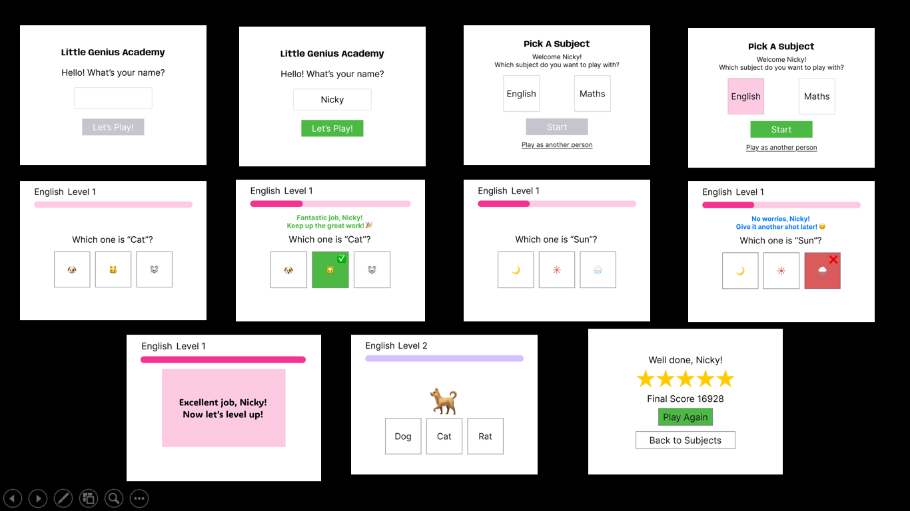

# Little Genius Academy
Welcome to Little Genius Academy! An interactive, gamified and safe learning platform for kids aged 5-7 that helps them practice English/Math concepts through fun quizzes and challenges while providing progress tracking.

## Purpose
The purpose of Little Genius Academy is to provide a fun and engaging learning platform for young children. Our goal is to foster creativity, critical thinking, and a love for learning through interactive activities and educational games. We aim to support parents and educators in nurturing the intellectual and emotional growth of children in a safe and supportive environment.

This project is built using HTML, CSS, and JavaScript. "Little Genius Academy" has been developed as part of Code Institute's Full-Stack Software Development Bootcamp as our 1st heckathon project. 

## Responsive Image

Am I responsive image

## User Experience (UX Design)


### User Stories

We used Miro board for user stories and brainstorming sessions. This tool helped us collaborate effectively, visualize our ideas, and organize our thoughts in a structured manner.

#### Primary / Secondary Users


#### Identify User Needs


#### MoSCoW Prioritization


#### Summary


#### High+level Project Idea


## Design

### Color Scheme
Our color scheme is designed to be visually appealing and engaging for young children. We use bright, vibrant colors to capture their attention and create a fun learning environment.


### Typography
We use child-friendly fonts that are easy to read and visually appealing. Our primary font is Patrick Hand and heading font is Tilt Warp, which is playful and suitable for our target audience.


### Wireframes
Wireframes were created to plan the layout and structure of our platform. These wireframes helped us ensure a user-friendly interface and a seamless user experience.

#### Desktop Wireframe Basic


#### Desktop Wireframe Background


## Technologies Used

###Languages Used

- HTML
- CSS
- JavaScript

### Frameworks, Libraries and Programs Used

- Bootstrap 5.3: Used for responsive design and styling.
- Google Fonts: Used to import the 'Outfit' and 'Funnel Sans' fonts.
- Font Awesome: Used for icons to enhance the visual appeal.
- Git: Used for version control.
- GitHub: Used to host the repository and deploy the website.
- Balsamiq: Used for creating wireframes.
- Google DevTools: Used for debugging and testing the website.
- Am I Responsive: Used to test the responsiveness of the website across different devices.
- Unsplash: Used for sourcing high-quality, royalty-free images to enhance the visual appeal of the website.
- Google Images: Used for finding images and inspiration for the website's design.
- Snipping Tool: Used for capturing screenshots during the development process.
- Chat GPT: Used for creating user stories
- Copilot: Used in coding some parts

A great tip for this section is to include them as you use them, that way you won't forget what you ended up using when you get to the end of your project.

## Deployment

### GitHub Pages
The project is deployed using GitHub Pages. GitHub Pages allows you to host your website directly from your GitHub repository. To deploy the project, follow these steps:
1. Ensure your repository has an `index.html` file at the root.
2. Navigate to the repository settings.
3. Scroll down to the "GitHub Pages" section.
4. Select the branch you want to deploy from (usually `main` or `master`).
5. Click "Save" and your site will be published at `https://<username>.github.io/<repository-name>/`.

## Local Development

### Prerequisites
To run this project locally, you need to have the following installed on your machine:
- Git
- A code editor (e.g., Visual Studio Code)

### Running the Project
Since this project is built with HTML, CSS, and JavaScript, you can simply open the `index.html` file in your web browser to view the project. Alternatively, you can use a live server extension in your code editor to serve the project locally.

### Making Changes
1. Open the project in your code editor.
2. Make your changes to the code.
3. Save the files.

### Committing and Pushing Changes when working in team

1. **Create a New Branch**
  Before making any changes, create a new branch for your work:
  ```bash
  git checkout -b <branch-name>
  ```

2. **Make Changes**
  Make your changes in the new branch. Ensure that your changes are well-documented and tested.

3. **Commit Changes**
  Add and commit your changes with a descriptive message:
  ```bash
  git add .
  git commit -m "Description of changes"
  ```

4. **Push Changes**
  Push your branch to the remote repository:
  ```bash
  git push origin <branch-name>
  ```

5. **Create a Pull Request**
  Go to the repository on GitHub and create a pull request. Describe the changes you made and request a review from your team members.

6. **Code Review**
  Team members should review the pull request, provide feedback, and request changes if necessary. Once approved, the pull request can be merged into the main branch.

7. **Merge Changes**
  After the pull request is approved, merge the changes into the main branch:
  ```bash
  git checkout main
  git pull origin main
  git merge <branch-name>
  ```

8. **Update Local Repository**
  Ensure your local repository is up-to-date with the main branch:
  ```bash
  git pull origin main
  ```

By following these steps, you can effectively collaborate with your team and maintain a clean and organized codebase.

git git 
### Testing

Validation of HTML/CSS/JavaScript,Lighthouse Audits,Bugs

## Google Lighthouse Testing

Achieved good scores for all the pages.Attaching the results of all the pages 

### Manual Testing & Automatic Testing

### Validators
This code has been validated through HTML and CSS validators, and necessary changes have been made accordingly.

#### CSS Validator

Attaching the result of css validation


#### HTML Validator


## Credits

### Content References

#### Copilot

- We have utilized GitHub Copilot to assist in generating content for the website.

#### Educational sites
 
- Education Quizzes - Some questions were taken from there.
- Google search engine

## Future features

## Acknowledgement
 
- We would like to extend our heartfelt thanks to Code Institute for providing this incredible platform and the opportunity to develop "Little Genius Academy."

- Special thanks to the instructors and mentors - Emma Lamont, Spencer and Ruairidh MacArthur for their invaluable guidance and support throughout the process.

- We would also like to express our gratitude to our amazing team for their hard work, dedication, and collaboration in bringing "Little Genius Academy" to life.


